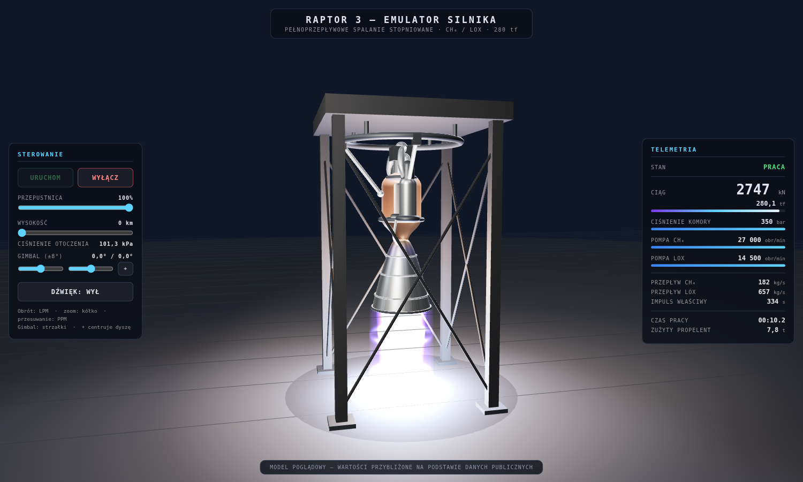
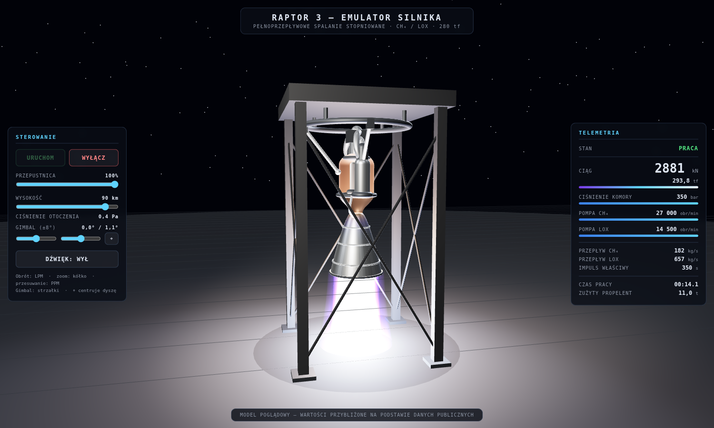

# Raptor 3 — Emulator silnika (Three.js)

Interaktywny emulator 3D silnika rakietowego **SpaceX Raptor 3** — pełnoprzepływowe
spalanie stopniowane, metan/ciekły tlen (CH₄/LOX). Silnik wisi na wirtualnym
stanowisku testowym: można go uruchomić, sterować przepustnicą i gimbalem,
zmieniać wysokość (ciśnienie otoczenia) i obserwować telemetrię na żywo.




## Uruchomienie

Aplikacja jest w pełni statyczna i działa offline (Three.js jest dołączony
w `vendor/`). Moduły ES wymagają serwera HTTP — wystarczy dowolny:

```bash
cd raptor3-emulator
python3 -m http.server 8000
# otwórz http://localhost:8000
```

albo `npx serve`, albo rozszerzenie Live Server w VS Code.

## Sterowanie

| Element | Działanie |
|---|---|
| **URUCHOM / WYŁĄCZ** | sekwencja startowa (rozruch pomp → zapłon → narastanie ciągu) i wyłączenie |
| **PRZEPUSTNICA** | 40–100% ciągu |
| **WYSOKOŚĆ** | 0–100 km — zmienia ciśnienie otoczenia, wygląd strugi i ciąg |
| **GIMBAL** | wychylenie dyszy ±8° (suwaki lub strzałki na klawiaturze, ⌖ centruje) |
| **DŹWIĘK** | syntezowany huk silnika (WebAudio, bez plików audio) |
| mysz | obrót (LPM), zoom (kółko), przesuwanie (PPM) |

## Co symuluje model

- **Sekwencję startową** jako maszynę stanów: rozruch turbopomp (spin prime),
  zapłon, narastanie ciągu, praca, wyłączanie — z bezwładnością pomp
  (inercja pierwszego rzędu, LOX wolniejszy od CH₄).
- **Ciąg zależny od otoczenia**: `F = F_vac − A_e · p_amb`, więc na poziomie
  morza wychodzi ~2745 kN (280 tf), a w próżni ~2880 kN.
- **Przepływy propelentów** z impulsu właściwego i stosunku mieszanki O/F = 3,6
  (~657 kg/s LOX + ~182 kg/s CH₄ przy pełnej mocy).
- **Strugę spalin**: shader addytywny z diamentami Macha przy wysokim ciśnieniu
  otoczenia i szeroką ekspansją w próżni; poświata wnętrza dyszy, błysk zapłonu,
  drgania kamery i oświetlenie dynamiczne skalują się z mocą.
- **Telemetrię**: ciąg, ciśnienie komory (do ~350 bar), obroty pomp, przepływy,
  Isp, czas pracy i zużyty propelent.

Przyjęte parametry (ciąg 280 tf, Isp ~350 s, p. komory ~350 bar, masa 1525 kg,
minimalna przepustnica ~40%) pochodzą z publicznie dostępnych materiałów SpaceX;
reszta (obroty pomp, stałe czasowe, geometria) jest oszacowana. To model
poglądowy do zabawy i nauki, nie narzędzie inżynierskie.

## Struktura

```
raptor3-emulator/
├── index.html          # UI + import map
├── css/style.css
├── js/
│   ├── main.js         # scena, pętla renderowania, sterowanie
│   ├── engineModel.js  # proceduralna geometria silnika i stanowiska
│   ├── simulation.js   # model fizyczny i maszyna stanów
│   ├── plume.js        # shader strugi spalin
│   ├── hud.js          # panel telemetrii
│   └── sound.js        # syntezowany dźwięk (WebAudio)
└── vendor/             # three.js r180 + OrbitControls + RoomEnvironment
```

Bez bundlera, bez zależności do instalowania — czysty JavaScript i Three.js.
