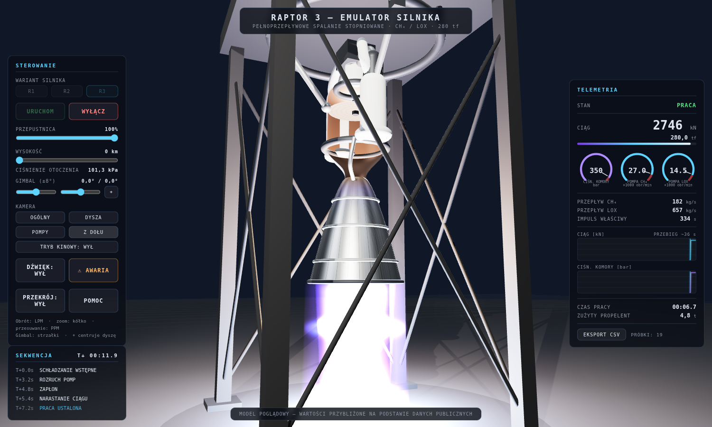

# Raptor — Emulator silnika (Three.js)

Interaktywny emulator 3D silnika rakietowego **SpaceX Raptor** (warianty 1/2/3) —
pełnoprzepływowe spalanie stopniowane, metan/ciekły tlen (CH₄/LOX). Silnik wisi
na wirtualnym stanowisku testowym: przechodzi pełną sekwencję startową ze
schładzaniem kriogenicznym, reaguje na przepustnicę i gimbal, psuje się na
życzenie (i jest ratowany przez FDS), a każdy test można wyeksportować do CSV.





## Uruchomienie

Aplikacja jest w pełni statyczna i działa offline (Three.js r180 jest dołączony
w `vendor/`). Moduły ES wymagają serwera HTTP — wystarczy dowolny:

```bash
cd raptor3-emulator
python3 -m http.server 8000
# otwórz http://localhost:8000
```

albo `npx serve`, albo rozszerzenie Live Server w VS Code.

## Funkcje

| Obszar | Co robi |
|---|---|
| **Sekwencja startowa** | schładzanie kriogeniczne → rozruch pomp → zapłon → narastanie → praca → wyłączanie; panel SEKWENCJA stempluje każdą fazę zegarem misji T+ |
| **Warianty silnika** | Raptor 1 (185 tf, 250 bar, gęste orurowanie) / Raptor 2 (230 tf) / Raptor 3 (280 tf, czysty) — przełączane w stanie GOTOWY |
| **Przepustnica** | 40–100% z ogranicznikiem tempa zmian (28 %/s w górę, 45 %/s w dół); etykieta pokazuje `zadana → rzeczywista` |
| **Wysokość** | 0–100 km: ciśnienie otoczenia, ciąg, niebo z gwiazdami i kształt strugi (diamenty Macha przy ziemi, szeroka ekspansja w próżni) |
| **Gimbal** | ±8° suwakami lub strzałkami; siłowniki podążają za dyszą |
| **Awarie + FDS** | ⚠ AWARIA wstrzykuje niestabilne spalanie / nadobroty pompy / nieudany zapłon; nadzór FDS sam tnie zawory, alarm miga i piszczy |
| **Widok przekroju** | płaszczyzna tnąca odsłania komorę, gardziel, poświatę i płytę wtryskiwacza |
| **Kamery** | presety OGÓLNY / DYSZA / POMPY / Z DOŁU z płynnym przelotem + TRYB KINOWY (auto-orbita) |
| **Telemetria** | tarcze zegarowe (p. komory, obroty pomp, redline), przewijane wykresy ciągu i Pc ze znacznikami zdarzeń, przepływy, Isp, czas, propelent |
| **Rejestrator** | próbkowanie 10 Hz przez cały test, EKSPORT CSV (`raptor3_test_NNN.csv`) |
| **Efekty** | opary kriogeniczne i szron na pompach, para na płycie, dym po wyłączeniu, błysk zapłonu, cienie, drgania kamery, syntezowany huk (WebAudio) |
| **POMOC** | opis FFSC po polsku, instrukcja, tabela wariantów, trwałe statystyki stanowiska (localStorage) |

Pełna historia rozwoju (15 iteracji: pomysły → wybór → implementacja → test)
jest w [docs/DEVLOG.md](docs/DEVLOG.md).

## Sterowanie

| Element | Działanie |
|---|---|
| **URUCHOM / WYŁĄCZ** | start i bezpieczne wyłączenie sekwencji |
| **R1 / R2 / R3** | wybór wariantu silnika (tylko w stanie GOTOWY) |
| suwaki | przepustnica, wysokość, gimbal X/Y (⌖ centruje) |
| strzałki | gimbal z klawiatury |
| **⚠ AWARIA** | usterka testowa (w stanie GOTOWY uzbraja nieudany zapłon) |
| **PRZEKRÓJ / POMOC / TRYB KINOWY / DŹWIĘK** | przełączniki |
| mysz | obrót (LPM), zoom (kółko), przesuwanie (PPM) |
| **EKSPORT CSV** | pobiera telemetrię ostatniego testu |

## Model fizyczny (skrót)

- Maszyna stanów z bezwładnością turbopomp (inercja 1. rzędu, LOX wolniejszy),
  szybszym odcięciem w trybie ABORT i ogranicznikiem przepustnicy.
- Ciąg `F = F_vac − A_e · p_amb`, przepływy z Isp i stosunku mieszanki
  O/F = 3,6 (Raptor 3 przy pełnej mocy: ~657 kg/s LOX + ~182 kg/s CH₄,
  ~2745 kN na poziomie morza, ~2880 kN w próżni, komora ~350 bar).
- Nadzór FDS: limity oscylacji spalania, obrotów pomp i czasu zapłonu.

Przyjęte parametry pochodzą z publicznie dostępnych materiałów SpaceX; reszta
(obroty pomp, stałe czasowe, geometria) jest oszacowana. Model poglądowy do
zabawy i nauki, nie narzędzie inżynierskie.

## Struktura

```
raptor3-emulator/
├── index.html          # UI + import map
├── css/style.css
├── js/
│   ├── main.js         # scena, pętla, kamery, cząstki, spinanie modułów
│   ├── engineModel.js  # proceduralna geometria silnika, stanowiska, wariantów
│   ├── simulation.js   # model fizyczny, maszyna stanów, awarie, warianty
│   ├── plume.js        # shader strugi spalin (diamenty Macha, ekspansja)
│   ├── particles.js    # cząstki GPU: opary, para, dym
│   ├── charts.js       # wykresy przewijane + tarcze zegarowe
│   ├── hud.js          # panel telemetrii i sekwencji
│   ├── recorder.js     # rejestrator telemetrii + eksport CSV
│   ├── stats.js        # trwałe statystyki stanowiska (localStorage)
│   └── sound.js        # syntezowany dźwięk + alarm (WebAudio)
├── docs/               # DEVLOG (dziennik iteracji) i zrzuty ekranu
└── vendor/             # three.js r180 + OrbitControls + RoomEnvironment
```

Bez bundlera, bez zależności do instalowania — czysty JavaScript i Three.js.
